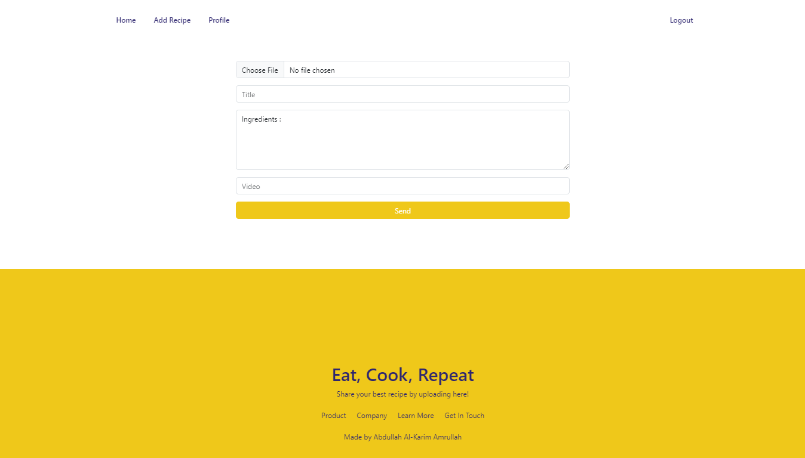

# Food Recipe Website

Website based application for Food Recipe built with ReactJS, ExpressJS, and PostgreSQL.

  

Food Recipe is a responsive website-based application that contains various recipes uploaded by users. In the recipe there is a description of the ingredients needed and cooking steps in the form of a video.

- Search for Recipes
- Pages for Add New Recipes
- Detail Recipes and Video Detail Recipes
- Pages for Authentication and Authorization

## Tech

Food Recipe Website uses a number of open source projects to work properly:

- [ReactJS](https://react.dev/) - frontend library
- [ExpressJS](https://expressjs.com/) - backend framework
- [PostgreSQL](https://www.postgresql.org/) - database

And of course Food Recipe website itself is open source with a [public repository](https://github.com/alkarim99/food-recipe-fe-react) on GitHub.

[Deploy Link](https://food-recipe-fe-react.vercel.app/) <br>
[Backend repository](https://github.com/alkarim99/food-recipe-be)

## Installation

Food Recipe Website able to run on your local, download this repo and open it using visual studio code, and run the terminal like below.

```sh
cd food-recipe-fe-react
npm i
npm start
```

## Screenshot

1. Landing Page <br>
   
   
   
   
2. Add Recipe Page <br>
   
3. Detail Recipe Page <br>
   
   
   
4. Profile Page <br>
   
5. Login Page <br>
   
6. Register Page <br>
   
